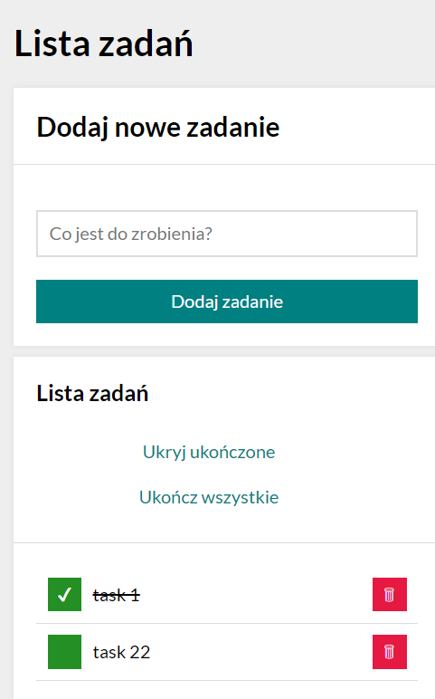

# Grzegorz Prabucki - Lista zadań
## ^_^

[demo](https://grzegorztestowy.github.io/modul7/)

## Welcome to the Readme :-)
I am presenting another project made for educational purposes.
This time it is a task list in which you can mark completed tasks and delete entries.

Presentation :

Used technologies:
- HTML
- CSS
- BEM
- Grid
- Media queries
- Immutability array in JavaScript
